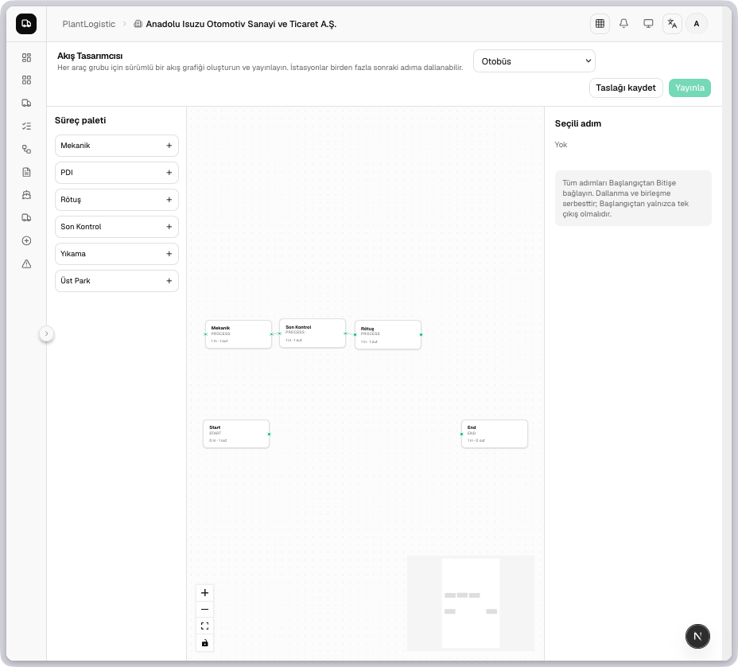

# PlantX — Industrial Operations Platform

[](https://github.com/aokcuoglu/plantx/releases/latest)


PlantX is a modular, multi-tenant industrial operations platform for OEMs, suppliers, dealers, distributors, and internal operations teams. The current platform combines supplier quality management, vehicle logistics, configurable business workflows, analytics, and a self-contained desktop runtime in one TypeScript monorepo.

## Latest Update — v3.8.0

Released on **31 August 2026**, v3.8.0 introduces enterprise workflow orchestration for PlantLogistic and completes a platform-wide UI, localization, and authorization hardening pass.

### Added

- Visual, versioned business workflow designer with draft, publish, archive, restore, and default-workflow management.
- Configurable workflow steps, transitions, action routing, user/organization-unit assignments, task ownership, and execution timelines.
- Tenant-scoped workflow definitions, versions, nodes, edges, instances, tasks, and event history backed by a production migration and seed/backfill path.
- Workflow-aware plan-sheet lifecycle with active-task visibility, assignee guidance, line review, forecast controls, and automatic order generation.
- Dedicated workflow graph, assignment, runtime, and plan-sheet validation tests.
- New reusable shadcn/ui primitives and expanded Turkish/English message coverage.

### Improved and fixed

- Enforced company scoping and active-workflow authorization across plan-sheet reads and mutations.
- Prevented stale or unauthorized vehicle moves with graph-aware routing, station ownership checks, revision guards, and audited admin overrides.
- Blocked missing, invalid, or past forecast dates; locked completed rows; and required rejection reasons before review transitions.
- Reworked the logistics board with optimistic drag-and-drop, clear recovery on errors, process ownership context, and responsive controls.
- Replaced native browser confirmations and raw form/table elements with consistent, accessible application primitives.
- Standardized semantic theme tokens, emerald brand accents, loading states, dialogs, and feedback across Quality, Logistic, settings, billing, and admin surfaces.
- Updated Next.js, Auth.js, Nodemailer, Prisma, and PDF dependencies to current patched release lines.
- Self-hosted the Geist font family and made Auth/Nodemailer workspace resolution deterministic for offline Docker and desktop builds.

[Read the full changelog](./CHANGELOG.md) · [View the GitHub release](https://github.com/aokcuoglu/plantx/releases/tag/v3.8.0)



## Platform Modules

| Module | Purpose | Status |
| --- | --- | --- |
| **PlantQuality** | Supplier quality, 8D, defects, PPAP, IQC, FMEA, field quality, scorecards | **Live** |
| **PlantLogistic** | Vehicle orders, plan sheets, process flows, dispatch, yard and dealer operations | **Live** |
| **Workflow Engine** | Versioned visual workflows, assignment rules, task routing and event history | **Live** |
| **Desktop** | Cross-platform Electron distribution with embedded PostgreSQL and local storage | **Live** |
| **PlantQuote** | RFQ and supplier bidding | Planned |
| **PlantTrace** | Traceability and carbon footprint | Planned |
| **PlantAudit** | Digital auditing, LPA and VDA | Planned |
| **PlantAsset** | Machinery maintenance and OEE | Planned |

## Product Capabilities

### PlantQuality

- Supplier defect reporting with image evidence, part context, ownership, SLA, and escalation.
- Structured 8D problem solving from containment and root cause through corrective action and closure.
- OEM review cycles, section-level comments, approval/revision controls, notifications, and audit timelines.
- PPAP, incoming quality (IQC), FMEA, field defects, supplier development, scorecards, and executive intelligence.
- PDF reporting plus PRO-gated AI brainstorming, review, and image-based defect analysis.

### PlantLogistic

- OEM, supplier, dealer, and distributor order flows with vehicle model and chassis/VIN management.
- Monthly plan sheets, production review, forecast dispatch dates, order generation, and complete timelines.
- Visual vehicle flow and business workflow designers with versioning and publication controls.
- Live operational board, dispatch queue, yard status, milestones, external visibility, and delay intelligence.
- Role-, task-, organization-, and company-scoped actions with audited operational overrides.

### Platform

- Turkish (`tr`, default) and English (`en`) localization without URL prefixes.
- Auth.js JWT sessions, development credentials, magic links, and Microsoft tenant-ready SSO fields.
- Multi-tenant PostgreSQL data model with Prisma 7 and server-side authorization boundaries.
- Cloud/S3-compatible storage for web deployments and local filesystem storage for desktop deployments.
- Light, dark, and system themes built on semantic design tokens and shared shadcn/ui primitives.

## Architecture

| Area | Technology |
| --- | --- |
| Web | Next.js 16 App Router, React 19, TypeScript strict |
| UI | Tailwind CSS 4, shadcn/ui, Base UI, Lucide, Recharts, XYFlow |
| Database | PostgreSQL 17, Prisma 7, JSONB |
| Auth | Auth.js v5, JWT sessions, Nodemailer magic links |
| Storage | Cloudflare R2 / S3-compatible storage, MinIO, local desktop adapter |
| Desktop | Electron, embedded PostgreSQL, local storage |
| Infrastructure | npm workspaces, Turborepo, Docker Compose, Orbstack |

```text
plantx/
├── apps/
│   ├── web/             Next.js application (@plantx/web)
│   └── desktop/         Electron runtime and packaging
├── packages/
│   └── db/              Prisma schema, migrations, seed and generated client
├── scripts/             Desktop and database orchestration
├── docker/              Container entrypoint
├── docker-compose.yml   App, PostgreSQL, MinIO and Mailpit
└── package.json         Workspace commands
```

## Quick Start

Prerequisites: Docker Desktop or Orbstack with Docker Compose support.

```bash
docker-compose up -d --build
```

| Service | URL |
| --- | --- |
| Application | http://localhost:3000 |
| MinIO Console | http://localhost:9001 |
| Mailpit | http://localhost:8025 |
| PostgreSQL | localhost:5432 |

The local seed creates an Anadolu Isuzu OEM tenant, enterprise admin accounts, organization units, and a published default plan-sheet workflow. Development login includes `admin@anadoluisuzu.com`; `superadmin@isuzu.com` is available for platform administration.

See [AGENTS.md](./AGENTS.md) for complete environment, architecture, review, i18n, design-system, and Electron guidance.

## Development Commands

```bash
npm install
npm run lint
npm run typecheck
npm run build
npm run db:generate
npm run db:migrate
npm run seed
npm run desktop:build
```

After every web code change, rebuild and restart the production-mode container:

```bash
docker-compose up -d --build app
```

## Environment

Copy the relevant example file for your deployment target. Never commit real credentials.

- Core: `DATABASE_URL`, `AUTH_SECRET`, `AUTH_URL`
- Object storage: `R2_ACCOUNT_ID`, `R2_ACCESS_KEY_ID`, `R2_SECRET_ACCESS_KEY`, `R2_BUCKET_NAME`
- AI: `AI_API_KEY`, `AI_BASE_URL`, `AI_MODEL`
- Notifications: `EMAIL_SERVER`, `EMAIL_FROM`
- Scheduled SLA processing: `CRON_SECRET`

Local Docker Compose provides PostgreSQL, MinIO, and Mailpit. Production deployments can use Supabase/PostgreSQL, Cloudflare R2, and Resend-compatible SMTP. The desktop application requires no external service in embedded mode.

## Quality and Security Rules

- Every tenant read and mutation must be scoped to the authenticated `companyId`.
- Server Actions must verify the actor, role, company type, and workflow/task ownership as applicable.
- Server Components are the default; client components are limited to interactive browser behavior.
- Every user-facing message must exist in both Turkish and English dictionaries.
- UI surfaces use semantic tokens and shared primitives; critical operations use application dialogs.
- Prisma schema changes require a migration, regenerated client, and a rebuilt application container.

Before contributing, read [CONTRIBUTING.md](./CONTRIBUTING.md), [PRD.md](./PRD.md), and the mandatory project rules in [AGENTS.md](./AGENTS.md).

## License

Proprietary. All rights reserved by PlantX Technologies.
